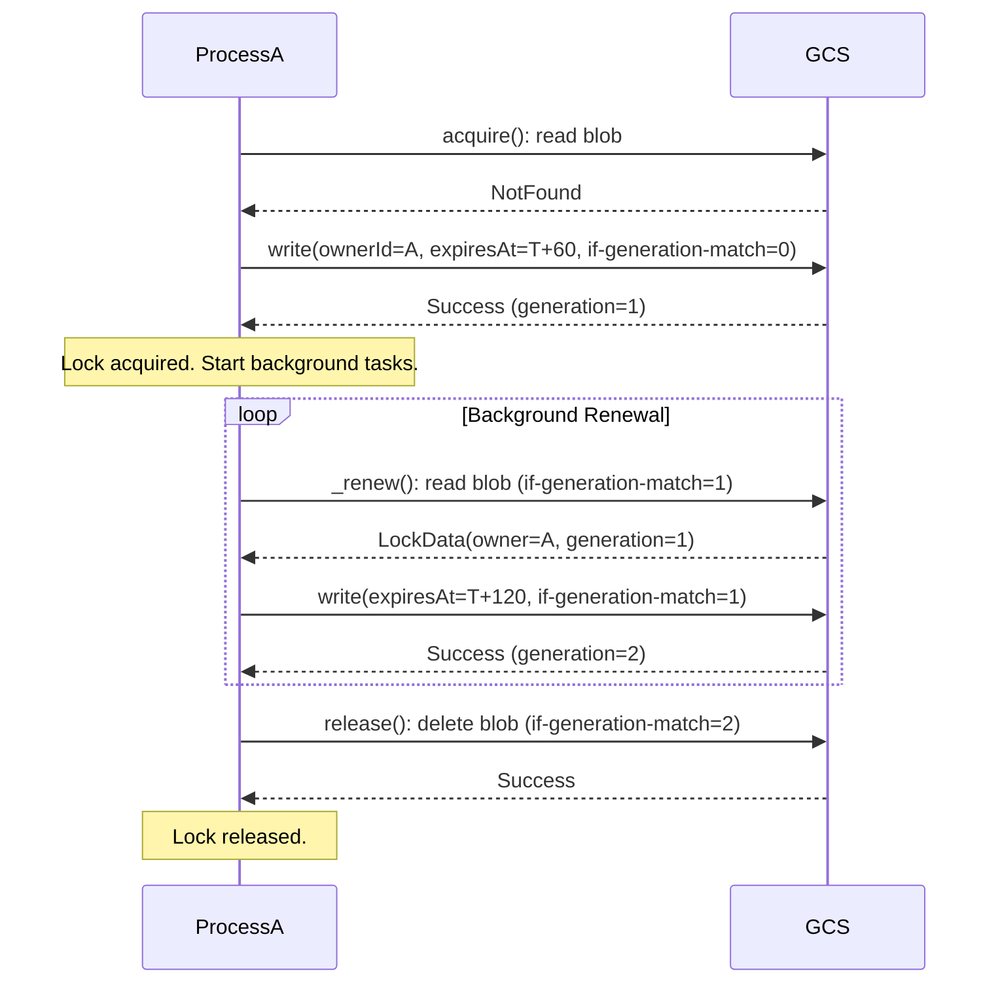
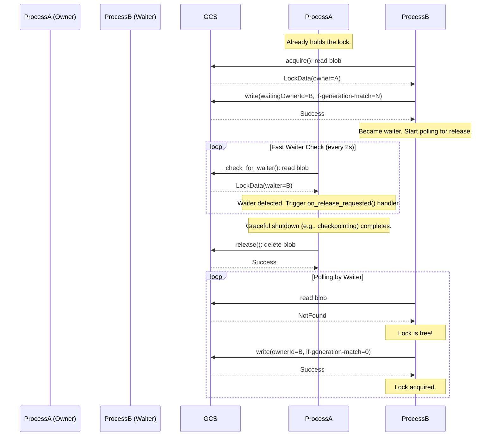

# GCS-Based Distributed Lock

This document outlines the implementation of the distributed lock which uses a Google Cloud Storage (GCS) object as the source of truth. It is designed to be a single-waiter lock, meaning only one process can be actively waiting to acquire the lock at any given time.

## Core Mechanism: Optimistic Concurrency Control

The entire locking mechanism is built on GCS's support for **optimistic concurrency control** using object **generations**.

- Every object in GCS has a unique `generation` number.
- When an object is updated or overwritten, its generation number changes.
- All write operations (`upload_from_string`, `delete`) can be conditioned on a specific generation number using the `if_generation_match` parameter.

If this condition is not met (meaning another process has modified the object since we last read it), GCS will raise a `PreconditionFailed` exception. Our code catches this exception to reliably detect and handle race conditions.

## Lock Metadata

The lock is a single JSON file in a GCS bucket with the following structure:

```json
{
  "ownerId": "unique-id-of-the-process-holding-the-lock",
  "expiresAt": 1678886400.0,
  "waitingOwnerId": "unique-id-of-a-process-waiting-for-the-lock",
  "waiterExpiresAt": 1678886460.0
}
```

- **`ownerId`**: A unique identifier for the process that currently holds the lock.
- **`expiresAt`**: A Unix timestamp. If the current time is past this timestamp, the lock is considered expired and can be acquired by another process.
- **`waitingOwnerId`**: A unique identifier for a single process that is waiting for the lock. If this is `null`, any process can attempt to become the waiter.
- **`waiterExpiresAt`**: A Unix timestamp for the waiter's request. This prevents a stale waiter from blocking the lock indefinitely.

## Main Flows

### 1. Standard Lifecycle (Acquire -> Renew -> Release)

This is the standard flow when there is no contention for the lock.



### 2. Handoff Lifecycle (Owner and Waiter)

This flow shows how a new process (`ProcessB`) becomes a waiter and acquires the lock after the current owner (`ProcessA`) releases it.



## Corner Cases, Errors, and Race Conditions

The use of `if_generation_match` is critical for handling the following scenarios:

- **Race on Initial Acquisition**: If two processes try to acquire a new lock at the same time, both will attempt to write with `if_generation_match=0`. Only the first one to reach GCS will succeed. The other will get a `PreconditionFailed` error, which our code translates into a `LockContentionError`.

- **Race to Become Waiter**: If two processes try to become the waiter for an existing lock, both will read the same generation number (`N`) and attempt to write with `if_generation_match=N`. Only the first one will succeed. The other will get a `PreconditionFailed` error and a `LockContentionError`.

- **Lock Lost or Stolen**: The `_renew()` method always checks if `lock_data.owner_id == self._owner_id`. If the lock was deleted (lost) or overwritten by another process (stolen), this check will fail. The method will then trigger the `on_renewal_error` handler and stop all background tasks, ensuring the process doesn't continue operating under the false assumption that it still holds the lock.

- **Unexpected Renewal Failure**: If any other unexpected `Exception` occurs during renewal (e.g., a network error, GCS service outage), the `except` block in `_renew()` will trigger the `on_renewal_error` handler and cancel the background tasks. This treats any failure during renewal as a critical event that invalidates the lock.
