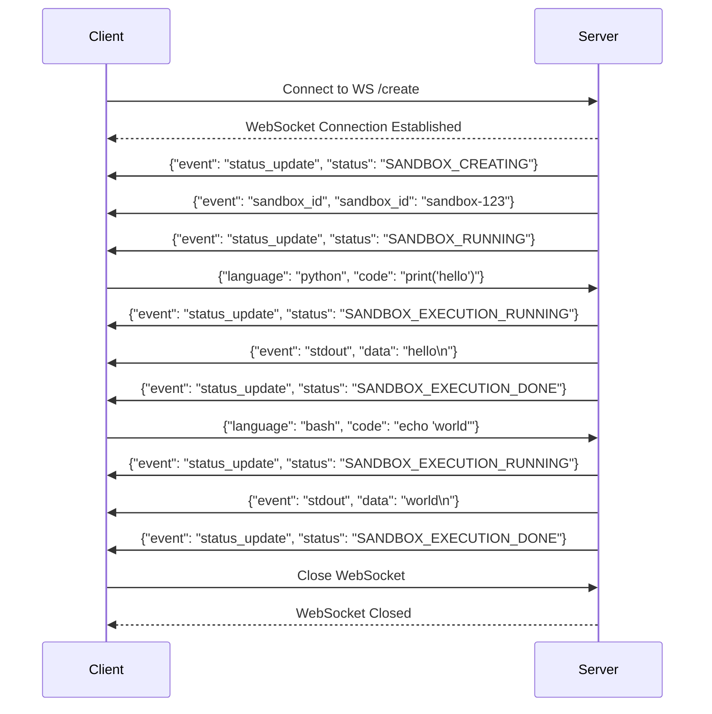
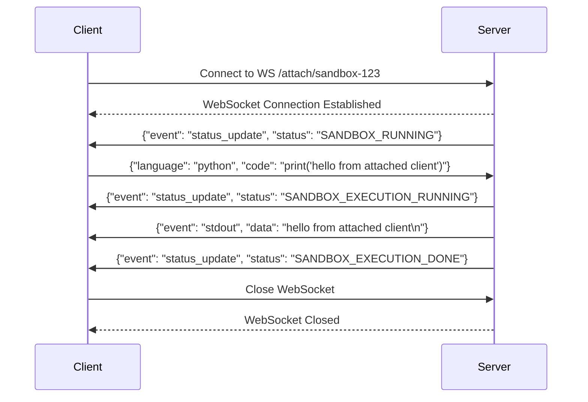
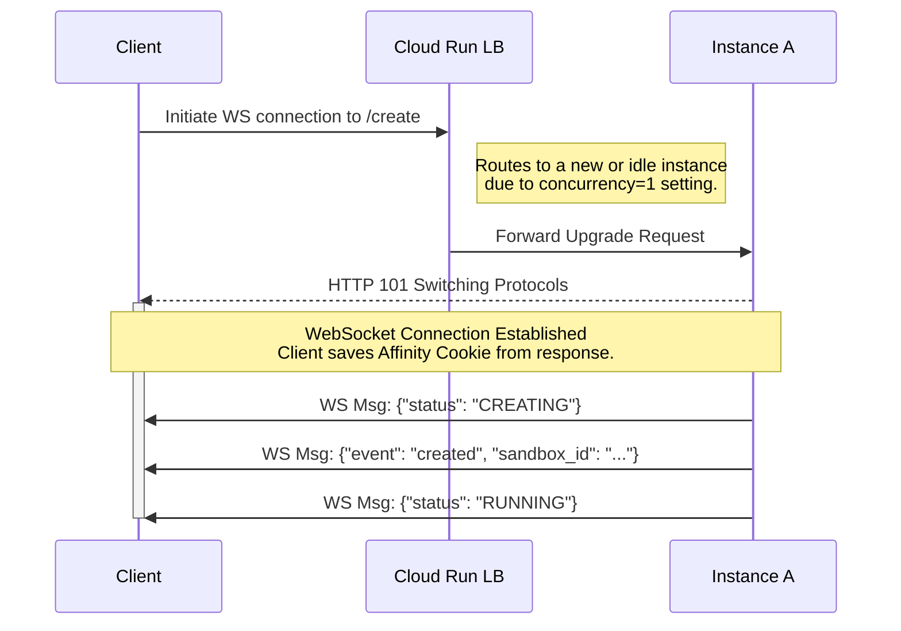
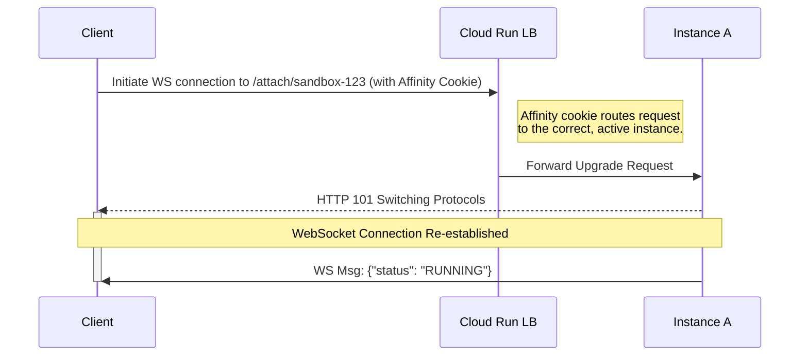
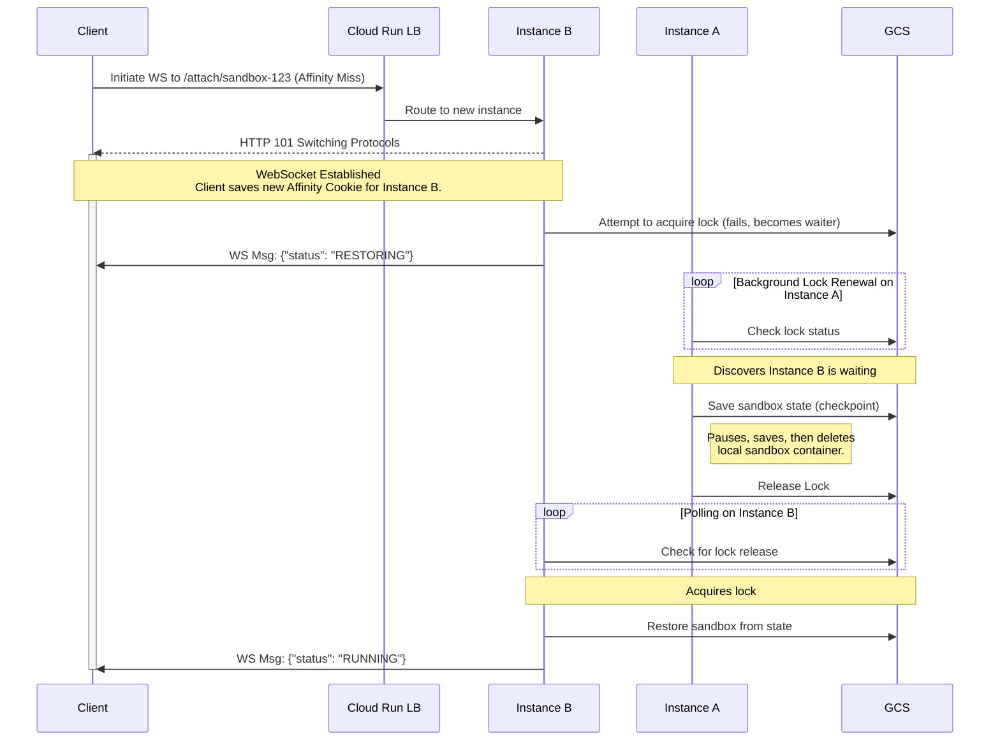

# Stateful Sandbox Lifecycle & Handoff Protocol Specification

This document specifies the design for making the gVisor sandbox application "stateful" on Cloud Run. It details a WebSocket-first protocol that handles instance handoffs transparently, orchestrated by a smart client library and coordinated via a shared GCS volume.

## 1. Core Concepts & Assumptions

### 1.1. Components

*   **Sandbox:** A logical, stateful entity identified by a unique `sandbox_id`.
*   **Instance:** An ephemeral Google Cloud Run instance.
*   **Client Library:** A smart client responsible for managing the WebSocket lifecycle, including the handoff protocol.
*   **GCS (Google Cloud Storage):** The shared backend for state persistence and distributed locking.

### 1.2. Assumptions about Cloud Run

*   **Statelessness:** Instances are ephemeral.
*   **Single Concurrency:** Each instance is configured for `--concurrency=1`. This is critical.
*   **WebSocket as "Instance Lease":** Because each instance is configured for a single concurrency, an active WebSocket connection effectively leases the instance. No other clients can connect, ensuring the instance is exclusively dedicated to a single client and sandbox.
*   **Best-Effort Session Affinity:** Session affinity is crucial for reconnecting a client to the correct instance. In the ideal case of a temporary network drop, it allows the client to reconnect to the *same* instance, resuming the session without a handoff. During a handoff, the temporary WebSocket connection to the new instance "warms up" this affinity, making it highly likely that the client's forced reconnect attempt lands on the correct new home for the sandbox.
*   **Shared GCS Volume:** All instances have a common GCS bucket mounted at `/gcs`.

### 1.3. The 1-to-1 Client-Instance-Sandbox Model

The single-concurrency setting implies:
*   **One Sandbox Per Instance:** An instance can only host one active sandbox.
*   **One Client Per Sandbox:** A sandbox is controlled by the single client that created it.

## 2. GCS State & Locking Layout

*   `/gcs/states/<sandbox_id>.state`: Stores the serialized gVisor state.
*   `/gcs/locks/<sandbox_id>.lock`: A lock file indicating a state transition is in progress.
    *   **Content:** `{"owner": "<instance_id>", "timestamp": <unix_timestamp>}`.
    *   **Atomicity:** Lock operations must be atomic (create-if-not-exists, rename).

## 3. Sandbox Lifecycle & Event Schema
 
This section defines the vocabulary and structure of messages sent from the server to
the client over the WebSocket.
 
### 3.1. Event Types
 
All messages are JSON objects with an `event` field that determines the message type.
 
*   `status_update`: Indicates a change in the sandbox's lifecycle state.
*   `sandbox_id`: Provides the unique ID of the newly created sandbox.
*   `stdout`: Represents an output event from the sandbox's standard output stream.
*   `stderr`: Represents an output event from the sandbox's standard error stream.
*   `error`: Indicates a fatal error that is not a direct output of the sandbox code.
 
### 3.2. State Events (`status_update`)
 
When the `event` is `status_update`, the message will also contain a `status` field. The
value will be one of the following strings, corresponding to the `SandboxStateEvent`
enum.
 
 *   `SANDBOX_CREATING`: The sandbox is being created and initialized.
 *   `SANDBOX_RUNNING`: The sandbox is running and ready to process code.
 *   `SANDBOX_NOT_FOUND`: The requested sandbox could not be found.
 *   `SANDBOX_IN_USE`: The requested sandbox is already attached to another client.
 *   `SANDBOX_CREATION_ERROR`: A non-recoverable error occurred during sandbox creation.
 *   `SANDBOX_EXECUTION_ERROR`: An error occurred during code execution.
 *   `SANDBOX_EXECUTION_RUNNING`: The sandbox is currently executing code.
 *   `SANDBOX_EXECUTION_DONE`: The sandbox has finished executing code.
  
 ### 3.3. Message Payloads
  
 *   **Status Update:** `{"event": "status_update", "status": "SANDBOX_RUNNING"}`
 *   **Sandbox ID:** `{"event": "sandbox_id", "sandbox_id": "sandbox-uuid-123"}`
 *   **Output Stream:** `{"event": "stdout", "data": "hello from sandbox\n"}`
 *   **Error:** `{"event": "error", "message": "The sandbox failed to start."}`

## 4. Concurrency Model

The system is designed with a strict and simple concurrency model to ensure predictable behavior.

### 4.1. Concurrent Execution

**Not Supported.** A single sandbox can only execute one command at a time. If a client sends a new execution request while a previous one is still running, the server will reject the new request with a `SANDBOX_EXECUTION_ERROR` and a descriptive error message. The client must wait for the `SANDBOX_EXECUTION_DONE` event before sending a new command.

### 4.2. Concurrent Attachments

**Not Supported.** Only one client may be connected to a sandbox at any given time. This prevents conflicting commands and ensures that the output stream is unambiguous.

*   When a client connects via `WS /create`, it becomes the sole attached client.
*   If another client attempts to connect to the same sandbox via `WS /attach/{sandbox_id}`, the server will reject the connection with a `SANDBOX_IN_USE` status and immediately close the WebSocket.
*   A client can only attach to a sandbox if no other client is currently connected. This typically happens after the creating client has disconnected.

## 5. Protocol: WebSocket-First Control & Data Plane

Communication is exclusively over WebSockets.

### 5.1. WebSocket Endpoints

*   `WS /create`: Creates a new sandbox.
*   `WS /attach/<sandbox_id>`: Connects to a pre-existing sandbox.

### 5.2. WebSocket Message Schema

The following diagrams illustrate the typical message flows between the client and server.

#### Create and Execute

#### Attach and Execute

## 6. Connection Scenarios & Handoff Protocol

### 6.1. Scenario 1: Creating a New Sandbox (`WS /create`)

This is the initial entry point for a user.

1.  **Client -> Server:** The client initiates a connection to `WS /create`. Because concurrency is set to 1, the Cloud Run load balancer will only route this request to a new or completely idle instance (`Instance A`), as any instances with active WebSockets are considered "in use".
2.  **Server -> Client (Connection Established):** `Instance A` accepts the connection by responding with **HTTP `101 Switching Protocols`**. The client library is expected to extract and save the session affinity cookie from this initial handshake response for future reconnection attempts.
3.  **Server -> Client (Status Updates):** `Instance A` sends a sequence of messages to inform the client of its progress:
    *   `{"event": "status_update", "status": "CREATING"}`
    *   A `sandbox_id` is generated.
    *   `{"event": "created", "sandbox_id": "exec-uuid-123"}`
    *   The local gVisor container is started.
    *   `{"event": "status_update", "status": "RUNNING"}`
4.  **Session Active:** The sandbox is now running and ready for I/O over the established WebSocket. The client library stores the `sandbox_id` for future reconnections.

### 6.2. Scenario 2: Reconnecting to an Existing Sandbox (No Handoff)

This is the "happy path" for reconnecting after a temporary network drop or when the client restarts.

1.  **Client -> Server:** The client initiates a connection to `WS /attach/sandbox-123`. The client library must include the previously saved session affinity cookie in the `Cookie` header of this connection request.
2.  **Routing:** The Cloud Run load balancer uses the affinity cookie to correctly route the request to `Instance A`.
3.  **Server -> Client (Connection Established):** `Instance A` receives the request, checks for `sandbox-123` locally, and finds it. It immediately responds with **HTTP `101 Switching Protocols`**.
4.  **Server -> Client (Status Update):** `Instance A` sends a confirmation message: `{"event": "status_update", "status": "RUNNING"}`.
5.  **Session Active:** The connection is successfully re-established without needing a handoff.

### 6.3. Scenario 3: Reconnecting to an Existing Sandbox (With Handoff)

This is the "affinity miss" path, which triggers the full handoff protocol. An affinity miss can happen for several reasons, such as the original instance crashing, being shut down during a scale-down event, the client not providing the affinity cookie, or the load balancer simply failing to honor it.

1.  **Client -> Instance B (Connection Attempt):** The client tries to connect to `WS /attach/sandbox-123`. It may have an affinity cookie for `Instance A`, but the load balancer routes it to a new, idle instance, `Instance B`.
2.  **Instance B (Immediate Upgrade & Wait for Lock):**
    *   Receives the `Upgrade` request and detects the sandbox is not local.
    *   It **immediately** responds with **HTTP `101 Switching Protocols`**. The WebSocket is now connected.
    *   It attempts to acquire the GCS lock for `sandbox-123` but finds it is held by `Instance A`. `Instance B` now enters a "waiter" state, periodically checking the lock.
3.  **Instance B -> Client (Control Message):**
    *   As its first message, `Instance B` sends: `{"event": "status_update", "status": "RESTORING"}` to inform the client that a handoff is in progress.
4.  **Client (Waiting & Updating):** The client library receives the "RESTORING" status. It must also update its stored session affinity cookie to the one received from `Instance B` during the successful connection handshake. The library now waits for a "RUNNING" status update.
5.  **Instance A (Detects Waiter & Initiates Handoff):**
    *   `Instance A`'s background lock renewal process runs. During the renewal check, it inspects the lock file on GCS and discovers that `Instance B` has registered itself as a waiter.
    *   Seeing the waiter, `Instance A` initiates the handoff. It checkpoints the sandbox state to GCS, terminates its local container, and releases the lock.
6.  **Instance B (Acquire Lock, Restore & Notify):**
    *   On its next check, `Instance B` finds the lock has been released. It acquires the lock.
    *   It sees the state file in GCS and restores the sandbox from the checkpoint.
    *   Once the sandbox is running locally, it sends a final status update over the **existing WebSocket connection**: `{"event": "status_update", "status": "RUNNING"}`.
7.  **Session Active:** The handoff is complete and transparent to the user. The session is now live on `Instance B` using the same WebSocket connection established in step 2.

