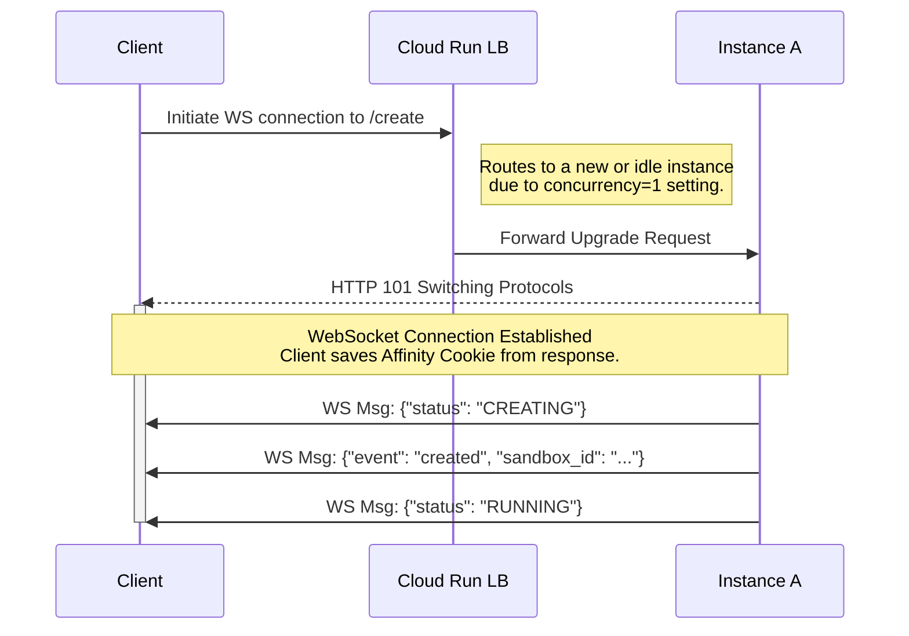
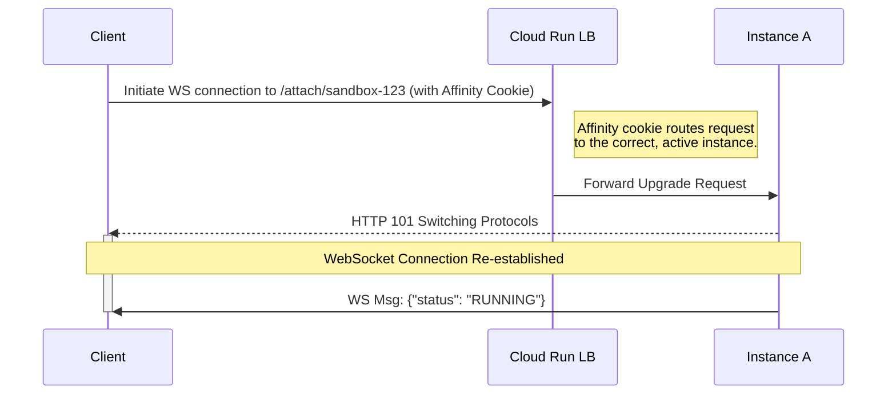
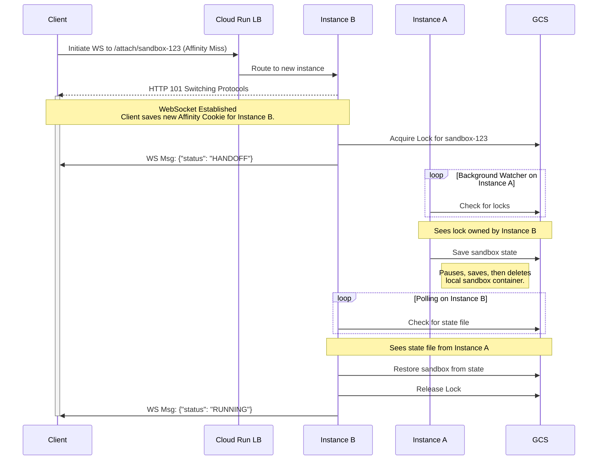

# Stateful Sandbox Lifecycle & Handoff Protocol Specification

This document specifies the design for making the gVisor sandbox application "stateful" on Cloud Run. It details a WebSocket-first protocol that handles instance handoffs transparently, orchestrated by a smart client library and coordinated via a shared GCS volume.

## 1. Core Concepts & Assumptions

### 1.1. Components

*   **Sandbox:** A logical, stateful entity identified by a unique `sandbox_id`.
*   **Instance:** An ephemeral Google Cloud Run instance.
*   **Client Library:** A smart client responsible for managing the WebSocket lifecycle, including the handoff protocol.
*   **GCS (Google Cloud Storage):** The shared backend for state persistence and distributed locking.

### 1.2. Assumptions about Cloud Run

*   **Statelessness:** Instances are ephemeral.
*   **Single Concurrency:** Each instance is configured for `--concurrency=1`. This is critical.
*   **WebSocket as "Instance Lease":** Because each instance is configured for a single concurrency, an active WebSocket connection effectively leases the instance. No other clients can connect, ensuring the instance is exclusively dedicated to a single client and sandbox.
*   **Best-Effort Session Affinity:** Session affinity is crucial for reconnecting a client to the correct instance. In the ideal case of a temporary network drop, it allows the client to reconnect to the *same* instance, resuming the session without a handoff. During a handoff, the temporary WebSocket connection to the new instance "warms up" this affinity, making it highly likely that the client's forced reconnect attempt lands on the correct new home for the sandbox.
*   **Shared GCS Volume:** All instances have a common GCS bucket mounted at `/gcs`.

### 1.3. The 1-to-1 Client-Instance-Sandbox Model

The single-concurrency setting implies:
*   **One Sandbox Per Instance:** An instance can only host one active sandbox.
*   **One Client Per Sandbox:** A sandbox is controlled by the single client that created it.

## 2. GCS State & Locking Layout

*   `/gcs/states/<sandbox_id>.state`: Stores the serialized gVisor state.
*   `/gcs/locks/<sandbox_id>.lock`: A lock file indicating a state transition is in progress.
    *   **Content:** `{"owner": "<instance_id>", "timestamp": <unix_timestamp>}`.
    *   **Atomicity:** Lock operations must be atomic (create-if-not-exists, rename).

## 3. Sandbox Lifecycle States

This section defines the vocabulary for the `status` field in WebSocket messages, allowing the client to operate as a state machine.

*   `CREATING`: The `WS /create` connection is open, but the sandbox is not yet running.
*   `RUNNING`: The sandbox is active on an instance and ready for interaction.
*   `SUSPENDED`: The sandbox state is persisted in GCS, but it is not running on any instance.
*   `HANDOFF`: The client has connected to a new instance, which is now actively pulling the sandbox state from a remote instance.
*   `TERMINATED`: The sandbox has been deleted.

## 4. Protocol: WebSocket-First Control & Data Plane

Communication is exclusively over WebSockets.

### 4.1. WebSocket Endpoints

*   `WS /create`: Creates a new sandbox.
*   `WS /attach/<sandbox_id>`: Connects to a pre-existing sandbox.

### 4.2. WebSocket Message Schema
(Schema remains the same as previous version)

## 5. Connection Scenarios & Handoff Protocol

### 5.1. Scenario 1: Creating a New Sandbox (`WS /create`)

This is the initial entry point for a user.

1.  **Client -> Server:** The client initiates a connection to `WS /create`. Because concurrency is set to 1, the Cloud Run load balancer will only route this request to a new or completely idle instance (`Instance A`), as any instances with active WebSockets are considered "in use".
2.  **Server -> Client (Connection Established):** `Instance A` accepts the connection by responding with **HTTP `101 Switching Protocols`**. The client library is expected to extract and save the session affinity cookie from this initial handshake response for future reconnection attempts.
3.  **Server -> Client (Status Updates):** `Instance A` sends a sequence of messages to inform the client of its progress:
    *   `{"event": "status_update", "status": "CREATING"}`
    *   A `sandbox_id` is generated.
    *   `{"event": "created", "sandbox_id": "exec-uuid-123"}`
    *   The local gVisor container is started.
    *   `{"event": "status_update", "status": "RUNNING"}`
4.  **Session Active:** The sandbox is now running and ready for I/O over the established WebSocket. The client library stores the `sandbox_id` for future reconnections.

### 5.2. Scenario 2: Reconnecting to an Existing Sandbox (No Handoff)

This is the "happy path" for reconnecting after a temporary network drop or when the client restarts.

1.  **Client -> Server:** The client initiates a connection to `WS /attach/sandbox-123`. The client library must include the previously saved session affinity cookie in the `Cookie` header of this connection request.
2.  **Routing:** The Cloud Run load balancer uses the affinity cookie to correctly route the request to `Instance A`.
3.  **Server -> Client (Connection Established):** `Instance A` receives the request, checks for `sandbox-123` locally, and finds it. It immediately responds with **HTTP `101 Switching Protocols`**.
4.  **Server -> Client (Status Update):** `Instance A` sends a confirmation message: `{"event": "status_update", "status": "RUNNING"}`.
5.  **Session Active:** The connection is successfully re-established without needing a handoff.

### 5.3. Scenario 3: Reconnecting to an Existing Sandbox (With Handoff)

This is the "affinity miss" path, which triggers the full handoff protocol. An affinity miss can happen for several reasons, such as the original instance crashing, being shut down during a scale-down event, the client not providing the affinity cookie, or the load balancer simply failing to honor it.

1.  **Client -> Instance B (Connection Attempt):** The client tries to connect to `WS /attach/sandbox-123`. It has a cookie for `Instance A`, but the load balancer routes it to a new instance, `Instance B`.
2.  **Instance B (Immediate Upgrade & Handoff Init):**
    *   Receives the `Upgrade` request and detects the sandbox is not local.
    *   It **immediately** responds with **HTTP `101 Switching Protocols`**. The WebSocket is now connected.
    *   It acquires the GCS lock for `sandbox-123`. If it fails (lock exists), it sends an `error` message and closes the connection.
3.  **Instance B -> Client (Control Message):**
    *   As its first message, `Instance B` sends: `{"event": "status_update", "status": "HANDOFF", "message": "Sandbox is being migrated."}`.
4.  **Client (Waiting & Updating):** The client library receives the "HANDOFF" status message. It must also update its stored session affinity cookie to the one received from `Instance B` during the successful connection handshake. The library now waits for a "RUNNING" status update.
5.  **Instance A (Background Relinquish):**
    *   `Instance A`'s background watcher sees the GCS lock.
    *   It saves the sandbox state to GCS and terminates its local container.
6.  **Instance B (Restore & Notify):**
    *   `Instance B` polls GCS, sees the state file, and restores the sandbox.
    *   Once the sandbox is running locally, it releases the GCS lock.
    *   It then sends a final status update over the **existing WebSocket connection**: `{"event": "status_update", "status": "RUNNING"}`.
7.  **Session Active:** The handoff is complete and transparent to the user. The session is now live on `Instance B` using the same WebSocket connection established in step 2.

